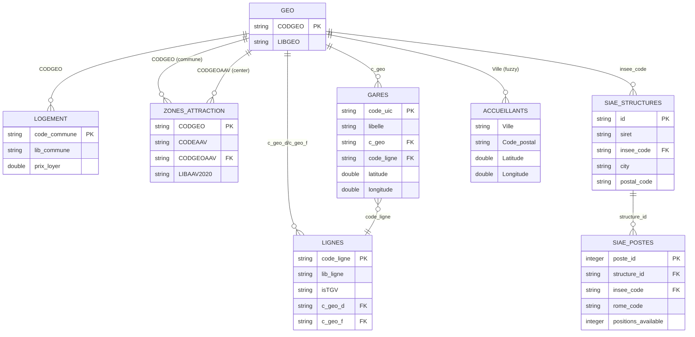

# Odace Data Model Documentation

## Table of Contents
- [Architecture Overview](#architecture-overview)
- [Silver Layer Schema](#silver-layer-schema)
- [Join Relationships](#join-relationships)
- [Data Flow](#data-flow)
- [Use Cases](#use-cases)

---

## Architecture Overview

The Odace data pipeline follows a medallion architecture with three layers:

```
┌─────────────────────────────────────────────────────────────────┐
│                        GOLD LAYER                                │
│              (Aggregated Business Metrics)                       │
└─────────────────────────────────────────────────────────────────┘
                              ▲
                              │
┌─────────────────────────────────────────────────────────────────┐
│                       SILVER LAYER                               │
│        (Cleaned, Standardized, Joined Data)                      │
│                                                                   │
│  ┌──────────┐  ┌────────────┐  ┌──────────┐  ┌──────────────┐  │
│  │   geo    │  │ accueillants│  │ logement │  │    gares     │  │
│  └──────────┘  └────────────┘  └──────────┘  └──────────────┘  │
│  ┌──────────┐  ┌────────────┐  ┌──────────┐  ┌──────────────┐  │
│  │  lignes  │  │zones_attrac│  │   siae   │  │ siae_postes  │  │
│  └──────────┘  └────────────┘  │structures│  └──────────────┘  │
│                                 └──────────┘                     │
└─────────────────────────────────────────────────────────────────┘
                              ▲
                              │
┌─────────────────────────────────────────────────────────────────┐
│                       BRONZE LAYER                               │
│            (Raw Data, Minimal Transformation)                    │
│                                                                   │
│  File Ingestion          │         API Ingestion                │
│  ─────────────────────   │   ───────────────────────           │
│  • geo                   │   • siae_structures                  │
│  • accueillants          │   • siae_postes                      │
│  • logement              │                                      │
│  • gares                 │                                      │
│  • lignes                │                                      │
│  • zones_attraction      │                                      │
└─────────────────────────────────────────────────────────────────┘
```

---

## Silver Layer Schema

### 1. geo (Geographic Reference Data)

**Purpose**: Master geographic reference table for French communes with INSEE codes.

**Schema**:
| Field | Type | Description | Key |
|-------|------|-------------|-----|
| `CODGEO` | STRING | INSEE commune code (5 digits) | PRIMARY KEY |
| `LIBGEO` | STRING | Standardized commune name | |

**Records**: ~34,935 French communes

**Usage**: Central reference table for geographic joins.

---

### 2. accueillants (Host Locations)

**Purpose**: Locations of host structures/organizations.

**Schema**:
| Field | Type | Description | Join Key |
|-------|------|-------------|----------|
| `statut` | STRING | Status of the host structure | |
| `Ville` | STRING | City name | → geo.LIBGEO |
| `Code_postal` | STRING | Postal code (5 digits) | |
| `Latitude` | DOUBLE | WGS84 latitude | Spatial |
| `Longitude` | DOUBLE | WGS84 longitude | Spatial |

**Records**: ~1,634 host locations

**Join Keys**:
- City name → `geo.LIBGEO`
- Spatial coordinates for proximity analysis

---

### 3. logement (Housing Data)

**Purpose**: Housing prices and statistics by commune.

**Schema**:
| Field | Type | Description | Join Key |
|-------|------|-------------|----------|
| `code_commune` | STRING | INSEE commune code (5 digits) | PRIMARY KEY → geo.CODGEO |
| `lib_commune` | STRING | Commune name | |
| `lib_epci` | STRING | EPCI (intercommunal) name | |
| `lib_dep` | STRING | Department name | |
| `lib_reg` | STRING | Region code | |
| `prix_loyer` | DOUBLE | Predicted rent per m² | |
| `borne_inf_pred` | DOUBLE | Lower bound of prediction | |
| `borne_sup_pred` | DOUBLE | Upper bound of prediction | |
| `niveau_pred` | STRING | Prediction level | |
| `rescued_data` | STRING | Data quality flag | |

**Records**: ~34,928 communes (deduplicated)

**Join Keys**:
- `code_commune` → `geo.CODGEO` (PRIMARY JOIN)

**Special Handling**: 
- Large city arrondissements mapped to main commune codes
- Paris (751XX → 75056), Lyon (693XX → 69123), Marseille (132XX → 13055)

---

### 4. gares (Train Stations)

**Purpose**: Railway station locations and metadata.

**Schema**:
| Field | Type | Description | Join Key |
|-------|------|-------------|----------|
| `code_uic` | STRING | UIC station code (unique) | PRIMARY KEY |
| `libelle` | STRING | Station name | |
| `fret` | STRING | Freight service (O/N) | |
| `voyageurs` | STRING | Passenger service (O/N) | |
| `code_ligne` | STRING | Line code | → lignes.code_ligne |
| `commune` | STRING | Commune name | → geo.LIBGEO |
| `departemen` | STRING | Department code | |
| `latitude` | DOUBLE | WGS84 latitude | Spatial |
| `longitude` | DOUBLE | WGS84 longitude | Spatial |
| `c_geo` | STRING | Geographic code | → geo.CODGEO |
| `ingestion_timestamp` | TIMESTAMP | Data load timestamp | |

**Records**: ~2,974 passenger stations (deduplicated)

**Join Keys**:
- `c_geo` → `geo.CODGEO`
- `commune` → `geo.LIBGEO`
- `code_ligne` → `lignes.code_ligne`
- Spatial coordinates for proximity analysis

**Filter**: Only passenger stations (`voyageurs = 'O'`)

---

### 5. lignes (Railway Lines)

**Purpose**: Railway line segments and characteristics.

**Schema**:
| Field | Type | Description | Join Key |
|-------|------|-------------|----------|
| `code_ligne` | STRING | Line code (unique) | PRIMARY KEY |
| `lib_ligne` | STRING | Line name | |
| `catlig` | STRING | Line category | |
| `isTGV` | STRING | High-speed line flag (0/1) | |
| `rg_troncon` | INTEGER | Section rank | |
| `c_geo_d` | STRING | Departure commune code | → geo.CODGEO |
| `c_geo_f` | STRING | Arrival commune code | → geo.CODGEO |
| `x_d_wgs84` | DOUBLE | Departure longitude | Spatial |
| `y_d_wgs84` | DOUBLE | Departure latitude | Spatial |
| `x_f_wgs84` | DOUBLE | Arrival longitude | Spatial |
| `y_f_wgs84` | DOUBLE | Arrival latitude | Spatial |
| `ingestion_timestamp` | TIMESTAMP | Data load timestamp | |

**Records**: ~933 line segments (deduplicated)

**Join Keys**:
- `code_ligne` → `gares.code_ligne`
- `c_geo_d` / `c_geo_f` → `geo.CODGEO`

---

### 6. zones_attraction (Urban Attraction Zones)

**Purpose**: Urban area of influence (AAV - Aire d'Attraction des Villes).

**Schema**:
| Field | Type | Description | Join Key |
|-------|------|-------------|----------|
| `CODGEO` | STRING | Commune INSEE code | PRIMARY KEY → geo.CODGEO |
| `LIBGEO` | STRING | Commune name | |
| `CODEAAV` | STRING | Urban area code | |
| `CODGEOAAV` | STRING | Central city INSEE code | → geo.CODGEO |
| `LIBAAV2020` | STRING | Urban area name | |
| `CATEAAV` | STRING | Urban area category | |
| `DEP` | STRING | Department code | |
| `REG` | STRING | Region code | |

**Records**: ~28,377 communes in urban areas

**Join Keys**:
- `CODGEO` → `geo.CODGEO` (commune)
- `CODGEOAAV` → `geo.CODGEO` (central city)

**Special Processing**:
- Excludes communes not in urban areas (AAV2020 = '000')
- Splits multi-city urban areas
- Fuzzy matching on city names

---

### 7. siae_structures (Social Inclusion Employment Structures)

**Purpose**: Employment structures offering social inclusion opportunities.

**Schema**:
| Field | Type | Description | Join Key |
|-------|------|-------------|----------|
| `id` | STRING | Unique structure ID (UUID) | PRIMARY KEY |
| `siret` | STRING | SIRET business identifier | |
| `structure_type` | STRING | Structure type (EI, AI, ETTI, etc.) | |
| `legal_name` | STRING | Legal company name | |
| `trade_name` | STRING | Trade name | |
| `phone` | STRING | Phone number | |
| `email` | STRING | Email address | |
| `website` | STRING | Website URL | |
| `description` | STRING | Description | |
| `accepting_applications` | BOOLEAN | Whether accepting job applications | |
| `created_at` | TIMESTAMP | Creation date | |
| `updated_at` | TIMESTAMP | Last update date | |
| `address_line_1` | STRING | Address line 1 | |
| `address_line_2` | STRING | Address line 2 | |
| `postal_code` | STRING | Postal code (5 digits) | |
| `city` | STRING | City name (normalized) | → geo.LIBGEO |
| `department` | STRING | Department code | |
| `insee_code` | STRING | INSEE code (enriched via join) | → geo.CODGEO |
| `standardized_city_name` | STRING | Standardized city name | |

**Records**: ~5,000-10,000 structures (national estimate)

**Data Source**: API - emplois.inclusion.beta.gouv.fr

**Join Keys**:
- `insee_code` → `geo.CODGEO` (enriched in silver layer)
- `city` + `postal_code` → `geo` (fuzzy match)

**Enrichment**: INSEE codes added by joining with `geo` table during silver transformation.

---

### 8. siae_postes (Job Positions in SIAE Structures)

**Purpose**: Active job openings in social inclusion structures.

**Schema**:
| Field | Type | Description | Join Key |
|-------|------|-------------|----------|
| `poste_id` | INTEGER | Unique job position ID | PRIMARY KEY |
| `structure_id` | STRING | Parent structure ID | → siae_structures.id |
| `siret` | STRING | SIRET of parent structure | |
| `rome_code` | STRING | ROME job classification code | |
| `job_title` | STRING | Job title | |
| `job_description` | STRING | Job description | |
| `contract_type` | STRING | Type of contract | |
| `is_recruiting` | STRING | Active recruitment flag | |
| `positions_available` | INTEGER | Number of open positions | |
| `created_at` | TIMESTAMP | Creation date | |
| `updated_at` | TIMESTAMP | Last update date | |
| `city` | STRING | City (from structure) | → geo.LIBGEO |
| `postal_code` | STRING | Postal code (from structure) | |
| `department` | STRING | Department (from structure) | |
| `insee_code` | STRING | INSEE code (from structure) | → geo.CODGEO |
| `structure_type` | STRING | Type of parent structure | |
| `structure_name` | STRING | Name of parent structure | |

**Records**: ~10,000-30,000 job positions (national estimate)

**Data Source**: API - emplois.inclusion.beta.gouv.fr (extracted from structures)

**Join Keys**:
- `structure_id` → `siae_structures.id`
- `insee_code` → `geo.CODGEO` (inherited from structure)

**Geographic Context**: All geographic fields inherited from parent structure.

---

## Join Relationships

### Entity Relationship Diagram



### Core Join Patterns

#### 1. Geographic Core (geo as Hub)

```
                    ┌─────────────────┐
                    │      GEO        │
                    │   (CODGEO)      │
                    └────────┬────────┘
                             │
        ┌────────────────────┼────────────────────┐
        │                    │                    │
        ▼                    ▼                    ▼
┌───────────────┐   ┌────────────────┐   ┌──────────────┐
│   LOGEMENT    │   │     GARES      │   │    SIAE      │
│ (code_commune)│   │    (c_geo)     │   │(insee_code)  │
└───────────────┘   └────────────────┘   └──────────────┘
                             │
                             ▼
                    ┌────────────────┐
                    │    LIGNES      │
                    │ (code_ligne)   │
                    └────────────────┘
```

**Join Key**: `CODGEO` (INSEE commune code)

**Datasets Joined**:
- `logement` via `code_commune`
- `gares` via `c_geo`
- `lignes` via `c_geo_d` / `c_geo_f`
- `zones_attraction` via `CODGEO` or `CODGEOAAV`
- `siae_structures` via `insee_code`
- `siae_postes` via `insee_code` (inherited)

---

#### 2. Transportation Network Join

```
┌────────────────┐
│     GARES      │
│  (code_ligne)  │
└────────┬───────┘
         │
         │ code_ligne
         │
         ▼
┌────────────────┐
│    LIGNES      │
│  (code_ligne)  │
└────────────────┘
```

**Join Key**: `code_ligne`

**Purpose**: Link stations to railway lines for route analysis.

---

#### 3. SIAE Hierarchy Join

```
┌─────────────────────┐
│  SIAE_STRUCTURES    │
│       (id)          │
└──────────┬──────────┘
           │
           │ structure_id
           │
           ▼
┌─────────────────────┐
│   SIAE_POSTES       │
│   (structure_id)    │
└─────────────────────┘
```

**Join Key**: `structure_id`

**Purpose**: Link job positions to their parent structures for full context.

---

#### 4. Urban Area Relationships

```
┌────────────────────┐
│  ZONES_ATTRACTION  │
│     (CODGEO)       │  ──────► Commune in urban area
└──────────┬─────────┘
           │
           │ CODGEOAAV
           │
           ▼
      ┌─────────┐
      │   GEO   │  ──────► Central city of urban area
      └─────────┘
```

**Join Keys**: 
- `CODGEO` → commune itself
- `CODGEOAAV` → central city of the urban area

**Purpose**: Understand urban area influence and hierarchy.

---

### Multi-Table Join Scenarios

#### Scenario 1: Housing Accessibility to SIAE Jobs

```
┌─────────┐    CODGEO    ┌──────────┐    CODGEO    ┌──────────────┐
│   GEO   │ ◄──────────► │ LOGEMENT │              │     SIAE     │
└─────────┘              └──────────┘              │  STRUCTURES  │
     ▲                                              └──────────────┘
     │                                                      ▲
     │ CODGEO (insee_code)                                │
     └──────────────────────────────────────────────────────┘

Purpose: Analyze housing prices near employment opportunities
```

#### Scenario 2: Transport Access to SIAE Locations

```
┌─────────┐    c_geo     ┌────────┐
│   GEO   │ ◄──────────► │ GARES  │
└─────────┘              └────────┘
     ▲
     │ CODGEO (insee_code)
     │
┌──────────────┐
│     SIAE     │
│  STRUCTURES  │
└──────────────┘

Purpose: Assess public transport accessibility to SIAE jobs
```

#### Scenario 3: Complete Urban Employment Analysis

```
                    ┌─────────┐
                    │   GEO   │
                    └────┬────┘
                         │ CODGEO
        ┌────────────────┼────────────────┐
        │                │                │
        ▼                ▼                ▼
┌──────────────┐  ┌──────────┐   ┌──────────────┐
│   LOGEMENT   │  │  GARES   │   │     SIAE     │
└──────────────┘  └──────────┘   │  STRUCTURES  │
        │                │        └──────┬───────┘
        │                │               │
        └────────────────┼───────────────┘
                         │
                         ▼
                ┌─────────────────┐
                │ ZONES_ATTRACTION│
                └─────────────────┘

Purpose: Comprehensive analysis of housing, transport, and 
         employment in urban areas
```

---

### Spatial Joins (Coordinates)

For proximity analysis using latitude/longitude:

**Tables with Spatial Data**:
- `accueillants`: Latitude, Longitude
- `gares`: latitude, longitude
- `lignes`: x_d_wgs84/y_d_wgs84, x_f_wgs84/y_f_wgs84

**Use Cases**:
- Find nearest train station to SIAE structure
- Calculate distance from host location to employment opportunity
- Identify SIAE structures within N km of a specific location

**Note**: Requires spatial functions (e.g., Haversine distance, PostGIS ST_Distance)

---

## Data Flow

### Bronze → Silver Transformation Summary

```
┌─────────────────────────────────────────────────────────────┐
│                    BRONZE LAYER                              │
│                   (Raw Data)                                 │
├─────────────────────────────────────────────────────────────┤
│  • Raw files from GCS                                       │
│  • API responses (SIAE)                                     │
│  • Nested structures                                        │
│  • Inconsistent formats                                     │
│  • Duplicates                                               │
└────────────────────┬────────────────────────────────────────┘
                     │
                     │ Transformations:
                     │ • Deduplication
                     │ • Type casting
                     │ • Column renaming
                     │ • Geo enrichment (SIAE)
                     │ • Flattening nested data
                     │
                     ▼
┌─────────────────────────────────────────────────────────────┐
│                    SILVER LAYER                              │
│                (Clean, Standardized)                         │
├─────────────────────────────────────────────────────────────┤
│  • Deduplicated records                                     │
│  • Standardized column names                                │
│  • Consistent data types                                    │
│  • INSEE codes enriched                                     │
│  • Ready for analysis                                       │
└─────────────────────────────────────────────────────────────┘
```

### Key Transformations by Table

| Table | Key Transformations |
|-------|-------------------|
| **geo** | • Extract INSEE code and name<br>• No deduplication needed |
| **accueillants** | • Handle missing status<br>• Preserve coordinates |
| **logement** | • Map Paris/Lyon/Marseille arrondissements<br>• Deduplicate by commune<br>• Keep latest data |
| **gares** | • Filter passenger stations only<br>• Deduplicate by UIC code<br>• Rename coordinates |
| **lignes** | • Add TGV flag<br>• Deduplicate by line code<br>• Cast data types |
| **zones_attraction** | • Exclude non-urban communes<br>• Split multi-city areas<br>• Fuzzy match city names with geo |
| **siae_structures** | • Normalize city names<br>• **Enrich with INSEE codes via geo join**<br>• Clean contact info |
| **siae_postes** | • Link to parent structure<br>• **Inherit geo context from structure**<br>• Standardize boolean flags |

---

## Use Cases

### 1. Housing Affordability Analysis

**Question**: Which communes have SIAE employment opportunities with affordable housing?

**Tables Joined**:
- `siae_structures` (employment locations)
- `siae_postes` (number of jobs available)
- `logement` (housing prices)
- `geo` (commune reference)

**Join Path**: 
```
siae_structures.insee_code → geo.CODGEO ← logement.code_commune
```

**Analysis**: Compare `logement.prix_loyer` with `siae_postes.positions_available` by commune.

---

### 2. Public Transport Accessibility

**Question**: How accessible are SIAE jobs by train?

**Tables Joined**:
- `siae_structures` (employment locations)
- `gares` (train stations)
- `lignes` (railway lines)
- `geo` (commune reference)

**Join Path**:
```
siae_structures.insee_code → geo.CODGEO ← gares.c_geo
gares.code_ligne → lignes.code_ligne
```

**Analysis**: Calculate distance from SIAE to nearest station, check line types (TGV vs regional).

---

### 3. Urban Area Employment Coverage

**Question**: Which urban areas have the most SIAE structures?

**Tables Joined**:
- `zones_attraction` (urban areas)
- `siae_structures` (SIAE locations)
- `geo` (commune reference)

**Join Path**:
```
zones_attraction.CODGEO → geo.CODGEO ← siae_structures.insee_code
```

**Analysis**: Count SIAE by urban area, analyze by category (`CATEAAV`).

---

### 4. Job Position Analysis

**Question**: What types of jobs are available in each department?

**Tables Joined**:
- `siae_postes` (jobs)
- `siae_structures` (structure metadata)

**Join Path**:
```
siae_postes.structure_id → siae_structures.id
```

**Analysis**: Aggregate by `department` and `rome_code`, sum `positions_available`.

---

### 5. Geographic Coverage Analysis

**Question**: Which communes lack SIAE employment opportunities?

**Tables Joined**:
- `geo` (all communes)
- `siae_structures` (SIAE locations)

**Join Path**:
```
geo.CODGEO ← LEFT JOIN ← siae_structures.insee_code
```

**Analysis**: Find communes with NULL SIAE matches, cross-reference with `logement` for population/housing data.

---

### 6. Proximity Analysis

**Question**: Find all SIAE structures within 10km of a specific location.

**Tables Used**:
- `siae_structures` (with `postal_code`, `city`)
- `accueillants` or `gares` (reference locations with coordinates)

**Method**: 
- Option 1: Join via `geo` and use postal code proximity
- Option 2: Geocode SIAE addresses and calculate Haversine distance

**Note**: SIAE structures don't have direct coordinates, but can be geocoded via address.

---

## Data Quality Notes

### INSEE Code Coverage

- **logement**: 100% (INSEE codes are source data)
- **gares**: ~95% (some stations lack `c_geo`)
- **siae_structures**: ~80-90% (enriched via city name fuzzy matching)
- **zones_attraction**: 100% (INSEE codes are source data)

### Deduplication Strategy

- **Primary key deduplication**: `gares` (UIC code), `lignes` (line code)
- **Composite key deduplication**: `logement` (commune code + latest timestamp)
- **No deduplication needed**: `geo`, `accueillants`, `zones_attraction`, `siae_structures`, `siae_postes`

### Known Data Limitations

1. **SIAE Coordinates**: Not directly available, requires geocoding
2. **City Name Matching**: Fuzzy logic may miss some matches (accents, hyphens, special characters)
3. **Large Cities**: Paris/Lyon/Marseille arrondissements aggregated to main commune
4. **Temporal Data**: Housing and SIAE data have timestamps, but others are point-in-time snapshots

---

## Summary

The Odace silver layer provides a **clean, standardized, and join-ready** dataset with:

- **8 core tables** covering geography, housing, transportation, and employment
- **INSEE codes as primary join key** for geographic analysis
- **Automatic enrichment** of API data (SIAE) with geographic context
- **Multiple join patterns** supporting complex multi-table analysis
- **Spatial capabilities** for proximity-based queries

All tables are optimized for analytical queries and ready for gold layer aggregations or direct business intelligence consumption.

